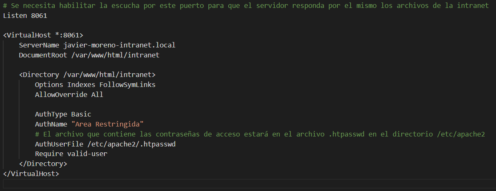

## 1º Paso
### Cambiamos el nombre de los virtualhost como se pide:

## 2º Paso
### Creamos un nuevo virtual host como se indica:

## 3º Paso
### Modificar el index.html:

## 4º Paso
### Añadir un nuevo usuario:

